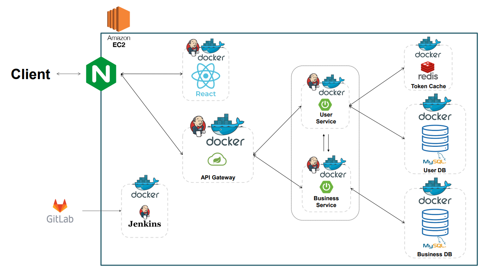

# Oh! MaRking

## Ⅰ. 프로젝트 개요

#### 1. 프로젝트 기간

- 2022년 10월 11일 - 11월 25일 (7주)

#### 2. 프로젝트 설명

- **Oh! MaRking**은 **익명으로 글을 남길 수 있는** **롤링페이퍼 서비스**입니다.

#### 3. 기획 배경

- 프로젝트 진행 시기를 고려하여 **수능**에 초점을 맞춰, 
- 길고 길었던 12년간의 교육과정을 갈무리하는 **수험생에게 결과가 어떻든 수고했다는 말과 함께 새로운 출발을** **응원**해주고 싶었습니다.
- 그러나 수험이라는 예민한 시기에는 **가족의 말 한마디도 자칫 부담**으로 다가올 수 있기에 
- **수험생을 최대한 배려하면서도 마음은 온전히 전할 수 있도록** 익명으로 글을 남기는 온라인 롤링페이퍼 서비스를 기획하게 되었습니다.

#### 4. 타당성 조사

- 서비스 타당성을 얻기 위해 10월 12일부터 15일까지 총 나흘간 **29명의 수험생을 대상으로 설문조사**를 실시했습니다.
- 설문은 다음과 같이 전체 설문 참여자 중 **82.8%가 서비스를 사용할 의향**이 있다고 답했습니다.

#### 5. 기능

- ##### OMR 생성

  수험생_소셜로그인_OMR카드생성.gif)

  > 수험생은 카카오로그인을 통해 **별도의 회원가입 절차 없이 간편하게 로그인이 가능**하며, 최초 로그인 시 자신의 OMR카드가 생성됩니다.

  

- ##### 링크공유

  수험생_링크공유.gif)

  > **링크복사 버튼**을 통해 자신 또는 수험생의 OMR카드를 **간편하게 공유**할 수 있습니다.

- ##### 메시지 작성

  응원_응원남기기_당일.gif)

  응원_응원남기기_해당날짜지정.gif)

  > **마킹되지 않은 칸**을 누르면, 메시지 작성이 가능합니다.
  >
  > 응원하고 싶은 마음만 있다면, 누구나 작성할 수 있도록 **비회원**으로도 글을 남길 수 있습니다.
  >
  > 메시지 작성 시에는 **공개 날짜를 설정**하도록 하여, 수능을 치루기 전과 후의 전하고픈 메시지를 작성할 수 있습니다.
  >
  > **태그**를 클릭하여 쉽고 재미있게 메시지를 남길 수 있습니다.

  

- ##### 메시지 수정 및 삭제
  
  응원_수정.gif)
  
  응원_삭제.gif)
  
  > **메시지 작성자**는 작성 당시 기입한 비밀번호를 확인하여, 메시지를 **수정 및 삭제**할 수 있습니다.
  
  ​	응원_삭제_수험생이직접삭제.gif)
  
  > 비난, 욕설 등 악의적인 메시지가 작성될 경우를 고려하여 **메시지 수신자(수험생)**는 별도 확인 없이 메시지를 삭제 할 수 있습니다.

- ##### 메시지 정보 조회

  응원_hover시툴팁으로정보표시.gif)

  > 마킹된 답안에 마우스를 올리면 해당 **메시지 작성자와 공개 날짜를 확인**할 수 있습니다.  

- ##### 메시지 상세 조회

  수험생_응원세부확인_마킹완료.gif)

  > 마킹된 답안을 클릭하면 메시지 내용을 상세히 확인할 수 있습니다.

  

  수험생_응원세부확인_공개지정날짜도달안한응원메시지확인시.gif)

  > 단, **지정한 공개날짜 전**에는 메시지를 **확인할 수 없습니다.**

  ​	

- ##### 검토하기

  수험생_즐겨찾기검토여부바꾸기_검토하기.gif)

  > 수험생(OMR 카드 주인)은 **다시보고 싶은 메시지**가 있다면, **검토 여부를 체크**하여 다른 메시지와 구별할 수 있습니다.

  

  즐겨찾기_캐러솔.gif)

  즐겨찾기_해당응원페이지의즐겨찾기만공개.gif)

  > **수험생(OMR 카드 주인)이 다시보고 싶어하는 메시지**를 확인할 수 있습니다.

  

  즐겨찾기_캐러솔클릭시해당응원글로이동.gif)

  > 해당 내용 클릭 시, 상세히 확인할 수 있으며, 검토 해제도 가능합니다.

  

- ##### 필적 확인란 및 색상 설정

  수험생_자기소개수정및색깔변경.gif)

  > 수험생은 **필적 확인란**을 통해 **자신의 상태나, 자신의 페이지에 접속한 사람들에게 전하고 싶은 말**을 보여줄 수 있습니다.
  >
  > **OMR** **색상을 변경**할 수 있습니다.

- **다음 교시**

  응원_20개미만일때_페이지추가X.gif)

  > **새로운 OMR 카드를 발급**받을 수 있습니다.
  >
  > 단, 마지막 교시를 기준으로 답안이 20개 미만일 때에는 추가되지 않습니다.

- **OMR 이동하기**

  수험생_응원목록확인.gif)

  > OMR 카드 옆에 방향키 버튼을 통해 다른 교시(OMR카드)로 이동할 수 있습니다.

## Ⅱ. 개발

#### 1. 개발 환경

- ##### [FrontEnd]

  - React 18.2.0

  - TypeScript 4.6.4

  - Scss 1.55.0

  - react-redux : 8.0.4

  - react-router-dom : 6.4.2

  - reduxjs/toolkit : 1.8.6

  - vite 3.1.0

- ##### [BackEnd]

  - JAVA zulu8

  - Eclipse 2020-06-R

  - Spring STS 3.9.14

  - MySQL 8.0.29 (select version(); 확인)

  - VSCode 1.69.0

  - Postman 9.23.3

  - Intellij 2022.1.3

  - NodeJS 16.16.0

  - Docker 4.9.1 (오류나서 최신버전으로 수정 20.10.17)

#### 2. 아키텍처

## Ⅲ. 산출물

#### 1. [포팅메뉴얼](assets\포팅메뉴얼.pdf)

#### 2. [Oh!MaRking_메뉴얼](assets\Oh!MaRking_메뉴얼.pdf)

#### 3. [UCC](https://youtu.be/GUN-JZtwqgE)

## Ⅳ. 협업툴

- GitLab
- Jira
- Notion
- Webex
- Mattermost

## Ⅲ. 팀원

##### Backend : 김대현, 전윤희, 서은지

##### Frontend : 노은영, 소정현, 임상은
